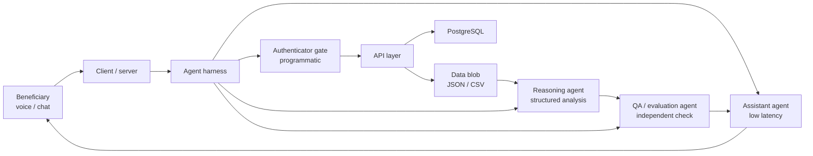

# Greivance Redressal Mechanism

**OpenG2P Beneficiary Conversational Agent**

A citizen-facing conversational service for government social-benefit programmes. Beneficiaries can ask questions, check eligibility, track benefit status, and raise grievances over voice or chat. Answers are grounded in authenticated programme data, not unsupported model inference.

[](https://www.python.org/)
[](#project-status)
[](https://openg2p.org)
[](https://github.com/KaushalrajPuwar/grm)

---

GRM is being built as one cohesive service, not a collection of loosely related apps. Dialogue stays lightweight and low-latency. Deeper analysis is delegated to a larger reasoning model. Independent evaluation sits in front of anything a beneficiary sees. Identity is a hard programmatic gate, not an agent.

The current system design is a north star, not a frozen contract. Components are written so they can be swapped, split, or replaced without collapsing the rest of the system.

## Why this exists

People enrolled in social-protection programmes often need a simple answer to a concrete question: whether they qualify, whether a payment has gone out, why a benefit is delayed, or how to escalate a complaint. Those answers live in structured programme records. They should not be improvised.

This service is the beneficiary-facing conversational layer for that problem. It is intended to sit in the [OpenG2P](https://openg2p.org) ecosystem, which provides registries and delivery systems for government-to-person transfers.

## What it does

| Capability | What the beneficiary gets |
| --- | --- |
| Information seeking | Grounded answers from authorised programme context |
| Scheme eligibility | Profile compared against scheme rules, with supported matches only |
| Benefit-status tracking | Current disbursement state, identified blockers, and next steps |
| Grievance redressal | Acknowledgement, contextual status, and escalation guidance |

Protected beneficiary and programme data is accessed only after the Authenticator Gate succeeds.

## Architecture

Three model roles, one programmatic security gate, and a harness that owns execution. No component is allowed to do another component's job.



### Runtime path

Server → Kubernetes → PostgreSQL → APIs → Data blob (JSON or CSV)

The data blob is the reasoning substrate. The reasoning agent analyses pre-fetched structured records. It does not roam the backend choosing arbitrary endpoints.

### Component boundaries

| Component | Kind | Owns | Must not |
| --- | --- | --- | --- |
| **Assistant agent** | Low-latency model | Greeting, clarification, presentation, satisfaction checks, session turns | Deep structured-data analysis |
| **Reasoning agent** | Larger reasoning model | Filtering the blob, interpreting records, synthesising a candidate answer | Owning the conversation or bypassing auth |
| **QA / evaluation agent** | Independent model | Retrieval validity, relevance, accuracy, completeness, safety | Talking to the beneficiary directly |
| **Authenticator gate** | Programmatic, non-agent | Identity verification and beneficiary-record resolution | Planning, intent reasoning, or answer generation |
| **Agent harness** | Infrastructure | Tool-chain execution, prompt-controlled flow, chat and session state | Becoming a fourth autonomous agent |

### Conversation lifecycle

1. **Session and identity.** Open a voice or chat turn. Resolve identity. Register a new record if none exists. Stay in the identity loop until verification succeeds.
2. **Routing.** Establish enrolment state, then take one of three paths: existing scheme, new scheme, or general query.
3. **Evidence.** Fetch authorised records and assemble the data blob.
4. **Reasoning.** Filter, analyse, and produce a candidate only when confidence clears the configured threshold.
5. **Evaluation.** An independent agent scores the candidate. Failures are sent back for revision. Unvalidated answers are not delivered.
6. **Close.** Ask whether the answer satisfied the query. Continue or auto-close from that explicit signal.

### In-scope scenarios

- **Non-receipt or delayed benefit** — disbursement status, likely blocker, correction path or escalation.
- **Scheme eligibility and recommendation** — profile matched to scheme rules; unsupported inference is rejected.
- **General grievance redressal** — complaint capture, status, next step; grievance context is held until the user is satisfied or the session closes.

## Tech stack

Locked 2026-09-22. Full rationale lives in [ARCHITECTURE.md](ARCHITECTURE.md) and [ADR.rst](ADR.rst).

| Layer | Choice |
| --- | --- |
| Language | Python 3.12 |
| Harness | LangGraph |
| Model clients | LangChain chat models, one fixed instance per agent |
| API | FastAPI plus Pydantic v2, strict JSON blob contracts |
| Beneficiary 360 | Typed client behind an interface, mock now, real client later |
| Channels | Transport neutral turn connector, versioned REST JSON, WebSockets later |
| Sessions | Redis |
| Blob snapshots | SQLite file plus Redis pointer, Postgres path open |
| Authenticator | Plain deterministic function plus thin FastAPI wrapper |
| Observability | LangSmith plus structlog JSON |
| Packaging | uv plus ruff plus mypy |
| Run | Local machine, containers at deploy time only |

## Design principles

**Authenticated context first.** No protected data before the gate succeeds.

**Structured evidence over improvisation.** Reasoning runs on the pre-fetched blob.

**Prompt-controlled flow.** Branching, clarification, satisfaction, and closure are harness state, not free-form model whim.

**Independent validation.** The model that writes a candidate is not the model that signs it off.

**Keep the front line light.** Routine dialogue stays on the assistant. The larger model is used where analysis actually needs it.

**Swap, do not weld.** Agents, models, storage, and transport are replaceable modules. Interfaces should survive a change of vendor, model, or deployment target.

## Project status

This repository is in **early scaffolding**. The design document in `docs/` describes the intended system. Implementation has not caught up, and the design itself is expected to move.

Treat the following as living, not final:

- agent topology and model assignment
- flow-control details
- backend contracts and the shape of the data blob
- voice and chat transport
- evaluation thresholds and retry policy

Build in thin, replaceable pieces. Do not collapse the system into a single irreversible path.

## Repository layout

```text
grm/
├── ARCHITECTURE.md       # living architecture and locked tech stack
├── ADR.rst               # architecture decision records
├── CHANGELOG.rst         # releases and contributors
├── docs/                 # design material (local; not a frozen spec)
├── pyproject.toml        # project metadata and dependencies
├── .python-version       # 3.12
├── .env.example          # required runtime configuration
└── README.md
```

Application packages, harness code, agent adapters, API clients, and tests will land as separate modules. Prefer a new module over growing a catch-all file.

## Prerequisites

- Python 3.12
- A virtual environment (the repo ships `.python-version` for that)
- Credentials for the model endpoints you intend to use

## Getting started

```bash
git clone https://github.com/KaushalrajPuwar/grm.git
cd grm
python3.12 -m venv .venv
source .venv/bin/activate
pip install -e .
cp .env.example .env
```

Fill in `.env` before running anything that talks to a model or a backend.

## Configuration

| Variable | Purpose |
| --- | --- |
| `API_KEY` | Credential for the configured model or API host |
| `BASE_URL` | Endpoint base for model access |
| `MODELID_1` | Model bound to one agent role |
| `MODELID_2` | Model bound to one agent role |
| `MODELID_3` | Model bound to one agent role |

Model identifiers are configuration, not architecture. Bind them at the adapter boundary so a role can change model without a rewrite of flow control.

## Development

Work as if every piece will be replaced.

- Keep the harness, the three agent roles, and the authenticator behind explicit interfaces.
- Do not let conversation state leak into the reasoning path, or reasoning output skip evaluation.
- Do not fold the authenticator into an agent prompt.
- Prefer typed boundaries and small modules over a shared utility pile.
- When in doubt, add a seam.

Testing strategy, service contracts, and ownership across the team will be documented as they are decided. Leave room for those decisions rather than encoding them early in the wrong layer.

## Contributing

This is an OpenG2P / jan-ai project, hosted on GitHub at [KaushalrajPuwar/grm](https://github.com/KaushalrajPuwar/grm).

1. Branch from the active development line.
2. Keep changes scoped to one module or one contract.
3. Open a pull request on [GitHub](https://github.com/KaushalrajPuwar/grm).
4. Say what you changed, what you deliberately left open, and what another teammate should not have to rediscover.

## Related

- [OpenG2P](https://openg2p.org) — open-source platform for registries and G2P delivery
- [OpenG2P documentation](https://docs.openg2p.org)
- [OpenG2P on GitLab](https://gitlab.com/openg2p)

## Licence

Licence to be confirmed with the OpenG2P project. Do not assume a licence until one is added to this repository.
